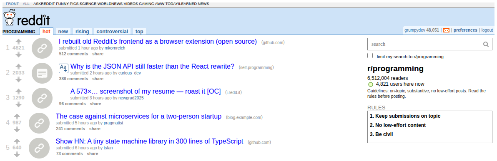
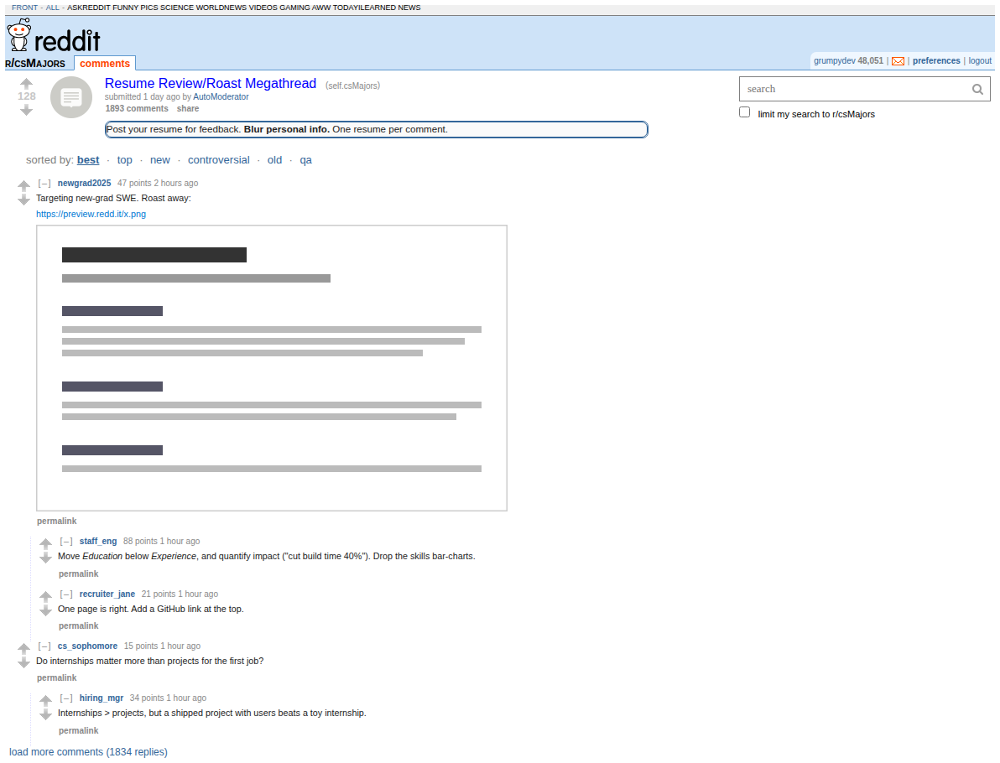
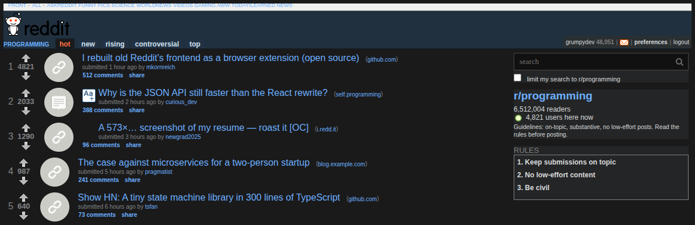

# Classic Layout for Reddit

**[▶ Install for Firefox (addons.mozilla.org)](https://addons.mozilla.org/addon/68acaf9111064d669ba0/)** &nbsp;·&nbsp; **[▶ Install for Edge (Microsoft Store)](https://microsoftedge.microsoft.com/addons/detail/classic-layout-for-reddit/jpccopdjifaoidblbnhaeobelcldnoop)** &nbsp;·&nbsp; Chrome/Brave/Opera: [load unpacked](#install-on-chrome-brave-and-opera)

A browser extension — **Firefox and Chrome / Chromium (Edge, Brave,
Opera)** — that **rebuilds Reddit's frontend into old Reddit**. It fetches each page
from Reddit's JSON API and renders old Reddit's *real* archived HTML + CSS, then
layers on RES-style power features.

> **Experimental & logged-in only.** It replaces new Reddit's DOM on
> listing/comment/profile/search pages. It needs a **logged-in** Reddit session
> (Reddit blocks the anonymous JSON API); on any API error it **falls back** to
> normal Reddit rather than showing a broken page.

What it does:

- **Old Reddit, rebuilt** — subreddit & front-page **listings**, **comment
  threads**, **user profiles**, and **search**, in old Reddit's genuine 2019 HTML +
  CSS (from the Wayback archive) fed by the live JSON API. Full header (your
  karma/mail, subreddit bar), the subreddit **sidebar** with rules, the **search
  box**, sort tabs, and the **time filter**.
- **Inline expandos** — click `[+]` to reveal a post's image / video / gallery /
  self-text; galleries have prev/next.
- **Infinite scroll** *(on by default)* — RES "never-ending reddit".
- **Keyboard navigation** — `j`/`k` move, `o`/Enter open, `x` expand.
- **Collapse comments** — `[–]` on any comment; comments new since your last visit
  are flagged.
- **Night mode** — dark theme (off by default, toggle in the popup).
- **Filters** — hide posts by subreddit / user / domain / title keyword (Options).
- **User tags & hover cards** — colored labels on users; hover a name or subreddit
  for a quick info card.

> Earlier versions were a lighter CSS **skin** of new Reddit (and before that, a
> **redirect** to old.reddit.com). Both were superseded by this full rebuild — see
> the git history / older releases if you want them.

---

## Screenshots

> Rendered from the extension's **own output** (its builders + the bundled
> old-Reddit stylesheet) with **sample data** — not a live-Reddit capture (Reddit
> blocks this build environment). In your browser it looks the same, with your feeds.

**Subreddit listing** — header, sidebar (search + rules), ranked posts, vote
arrows, and per-post `[+]` expandos:



**Comments** — `[–]` collapse toggles, the *sorted by* menu, an inline
`preview.redd.it` image, and the auto-loading "load more comments":



**Night mode** (optional dark theme):



---

## Please read — this is an approximation

New Reddit is a fundamentally different page from old Reddit, so this skin **shifts
colours/typography/density and hides clutter** rather than reproducing old Reddit
exactly. It is inherently fragile:

- It **can't restyle everything.** Parts of new Reddit live inside *closed* Shadow
  DOM that no extension can reach. The skin injects into the main document and
  every *open* shadow root it can find; closed roots stay unstyled.
- It targets shreddit's **custom-element tag names, slot names, and user-facing
  text** (all more stable than Reddit's hashed class names), but Reddit can still
  **break it on any deploy**. When that happens, the fix is updating the selectors
  in [rebuild.js](rebuild.js) / [vendor/oldreddit.css](vendor/oldreddit.css).
- It will **never be a pixel match** for `old.reddit.com`.

---

## Install on Firefox

### Option 1 — Firefox Add-ons store (recommended, one click)

**[▶ Install from Firefox Add-ons (addons.mozilla.org)](https://addons.mozilla.org/addon/68acaf9111064d669ba0/)**

1. Open the link above **in Firefox**.
2. Click **Add to Firefox** → **Add**.
3. **Log in to Reddit** (the extension reads Reddit's own API, which requires being
   signed in), then open any subreddit — e.g. `https://www.reddit.com/r/pics` — and it
   renders in the classic layout.
4. Manage it any time from the toolbar button (quick toggles) or
   `about:addons` → **Classic Layout for Reddit** → **Preferences** (all settings + filters).

It's reviewed and signed by Mozilla, so it installs permanently and auto-updates.

### Option 2 — From the signed `.xpi` (GitHub Releases)

1. Download the latest **`.xpi`** from the
   [**Releases**](https://github.com/mkornreich/old_reddit/releases/latest) page.
2. Install it either way:
   - **Drag** the `.xpi` onto any Firefox window → click **Add**, or
   - `about:addons` → the gear ⚙️ → **Install Add-on From File…** → pick the `.xpi`.

The `.xpi` is signed by Mozilla, so it installs permanently on regular Firefox and
survives restarts.

### Option 3 — Temporary, from source (no signing, great for hacking)

1. Clone this repo.
2. Open **`about:debugging`** → **This Firefox** → **Load Temporary Add-on…**.
3. Select **`manifest.json`** in the repo.
4. It runs until you restart Firefox.

### Option 4 — Build & sign it yourself

Firefox only installs a *permanent* add-on if it's signed by Mozilla. To produce
your own signed `.xpi` with [`web-ext`](https://extensionworkshop.com/documentation/develop/getting-started-with-web-ext/):

```bash
npm install
npm run lint
npm run sign:unlisted   # needs AMO API key + secret; produces a signed .xpi
```

AMO credentials (a JWT **issuer** + **secret**) come from
<https://addons.mozilla.org/developers/addon/api/key/>, passed via the
`WEB_EXT_API_KEY` / `WEB_EXT_API_SECRET` environment variables. Then install the
resulting `.xpi` as in Option 1.

> **Note:** requires Firefox **142+** (set in `manifest.json`).

---

## Install on Microsoft Edge

**[▶ Install from the Microsoft Edge Add-ons store](https://microsoftedge.microsoft.com/addons/detail/classic-layout-for-reddit/jpccopdjifaoidblbnhaeobelcldnoop)**

One-click install, reviewed by Microsoft — it installs permanently and auto-updates, with no Developer mode needed.

1. Open the link above **in Microsoft Edge**.
2. Click **Get** → **Add extension**.
3. **Log in to Reddit** (the extension reads Reddit's own API, which requires being
   signed in), then open any subreddit — e.g. `https://www.reddit.com/r/pics` — and it
   renders in the classic layout.
4. Manage it any time from the toolbar button (quick toggles) or
   `edge://extensions` → **Details** → **Extension options** (all settings + filters).

> Edge is Chromium-based, so you can alternatively load it **unpacked** for development
> (see the Chrome steps below) — but the store is the easy path.

---

## Install on Chrome, Brave, and Opera

There's no Chrome Web Store listing yet, so install it **unpacked** from a clone of
this repo. All three are Chromium-based, so the **same folder** loads in every one of
them — no separate build.

1. Clone or download this repo to a folder you'll **keep in place** (Chrome
   remembers the path; if you move or delete the folder, the extension breaks on
   next launch).
2. Open the extensions page by typing one of these in the address bar (these
   can't be clickable links):
   - Chrome: `chrome://extensions`
   - Edge: `edge://extensions`
   - Brave: `brave://extensions`
   - Opera: `opera://extensions`
3. Turn on **Developer mode** (toggle top-right on Chrome/Brave/Opera; left sidebar on Edge).
4. Click **Load unpacked** and select the **repo folder** (the one containing
   `manifest.json` — the folder itself, not a file).
5. Open `https://www.reddit.com/r/pics` — it should be restyled. Pin the toolbar
   button via the puzzle-piece 🧩 icon to toggle the skin, or use **Details →
   Extension options**.

> **Heads-up:** unpacked extensions run in Developer mode. A browser update or
> profile reload can auto-disable a dev-mode extension — just re-enable it at
> `chrome://extensions` if that happens.
>
> **Polished option:** publishing to the Chrome Web Store ($5 one-time developer
> fee) gives one-click installs that survive updates and need no Developer mode.
> Brave and Opera can install from the Chrome Web Store too. (Edge already has its
> own one-click store listing — see above.)

### Publishing to the Chrome Web Store

A ready-to-upload package is checked in at
**[`dist/old-reddit-skin-chrome-3.7.6.zip`](dist/)** (`manifest.json` at the zip
root, Chrome-validated, Firefox-only manifest keys stripped). To publish:

1. Register once at the [Chrome Web Store developer dashboard](https://chrome.google.com/webstore/devconsole/)
   (one-time $5 USD fee).
2. **New item** → upload the zip.
3. Fill in the listing: a ≥1280×800 screenshot, a description, and the privacy
   section — declare **no data collected** (the extension only reads Reddit pages
   to restyle them and stores a single on/off flag locally).
4. Submit for review.

To rebuild the zip after changes:

```bash
npm run build                                   # web-ext build -> web-ext-artifacts/*.zip
# then strip the Firefox key + repackage into dist/ (see the release build for exact steps)
```

The **same zip** also uploads to the free [Edge Add-ons](https://partner.microsoft.com/dashboard/microsoftedge/)
store if you ever want an Edge listing.

---

## Experimental: Rebuild mode

Turn on **Rebuild frontend** (toolbar/options toggle) and, on a subreddit /
front-page **listing**, a post's **comments** page, a **user profile**, or a
**search**, the
extension stops *skinning* new Reddit and instead **rebuilds old Reddit's real
frontend**: it fetches the data from Reddit's JSON
API and renders old Reddit's actual `#siteTable` of `.thing.link` items — ranks,
vote arrows, thumbnails, taglines, comment counts, an **expando button** (click to
reveal a post's image/video/gallery/self-text inline), sort tabs, next/prev paging, the
**time filter** (`top`/`controversial`: past hour → all time), and the **subreddit
sidebar** (description + rules, from `/about.json` + `/about/rules.json`) — styled by
old Reddit's genuine archived stylesheet (`vendor/oldreddit.css`, the 2019 desktop
CSS, bundled with its asset URLs rewritten to `redditstatic.com`).

**How the data works:** a content script does a same-origin
`fetch('…/.json', {credentials:'include'})` that rides your logged-in session.

**Honest limitations (please read):**

- **Logged-in only.** Reddit shut off *unauthenticated* `.json` in 2026, so
  logged-out visitors get `403`. On any non-200 the extension **falls back** to
  letting normal Reddit render — it never leaves the page blank.
- **Read-only.** Voting, saving, posting, and commenting are **not** wired up (they
  need an OAuth write token). The arrows/buttons render for looks but are inert.
- **Listings, comments, user profiles, and search.** Post permalinks render old
  Reddit's comments page (nested tree, "sorted by" menu, "load more" via
  morechildren); `/user/{name}` renders the profile (overview/submitted/comments
  tabs + karma sidebar); `/search` renders results with sort/time filters. Every
  page carries the real old-Reddit **header** (username, karma, mail badge, the
  subreddit bar — from `/api/me.json`) and old Reddit's **search box** at the top of
  the sidebar, right where it belongs. Modtools, wiki, and settings still fall
  through to normal Reddit.
- **Fragile & unsupported.** The cookie `.json` path has no SLA; Reddit could close
  it. Media embeds/galleries, awards, and live updates aren't reproduced. Treat
  this as a proof-of-concept.

With Rebuild off (default), the extension is just the CSS skin described above.

---

## Develop

```bash
npm install
npm start          # web-ext run: live-reloading test profile
npm run lint       # web-ext lint
npm run build      # distributable .zip in web-ext-artifacts/
```

---

## Options

Click the toolbar button (or open the add-on's preferences in `about:addons`):

- **Enable old Reddit** — master on/off.
- **Night mode** — dark theme (off by default).
- **Infinite scroll** — auto-load the next page (on by default).
- **Filters** *(Options page)* — hide posts by subreddit / user / domain / title keyword.

Keyboard nav, comment collapse, hover cards, user tags, back-to-top and inline
expandos are always on. All settings live in `storage.local`.

---

## How it works

A single content script ([common.js](common.js) + [rebuild.js](rebuild.js)) runs at
`document_start` on `www.reddit.com` / `sh.reddit.com`:

- **Route** — [common.js](common.js) maps the URL to a listing / comments / user /
  search route (else it leaves new Reddit alone).
- **Fetch** — a same-origin `fetch('{path}/.json', {credentials:'include'})` (and
  `/api/me.json`, `/about.json`, `morechildren`, …) rides your logged-in session.
- **Render** — [rebuild.js](rebuild.js) builds old Reddit's real markup from the JSON
  and swaps out new Reddit's `<body>`, styled by
  [vendor/oldreddit.css](vendor/oldreddit.css) (the archived 2019 stylesheet, asset
  URLs rewritten to `redditstatic.com`).
- **Enhance** — keyboard nav, comment collapse, infinite scroll, night mode, filters,
  user tags, hover cards and inline expandos run on the rebuilt DOM.
- **Fail safe** — a visibility guard + 8s watchdog; any non-200 (e.g. logged-out
  `403`) reveals normal Reddit instead of a blank page.

---

## Files

| File | Purpose |
|------|---------|
| `manifest.json` | MV3 manifest (Firefox + Chrome), registers the content scripts |
| `rebuild.js` | Content script: rebuilds old Reddit from the JSON API + all RES-style features |
| `vendor/oldreddit.css` | Old Reddit's real archived 2019 stylesheet (source) |
| `vendor/oldreddit.bundled.css` | The above with asset URLs rewritten — the file injected at runtime |
| `vendor/dash.mediaplayer.min.js` | [dash.js](https://github.com/Dash-Industry-Forum/dash.js) (BSD-3-Clause) — MSE playback for v.redd.it videos with audio |
| `scripts/build-css.mjs` | Rebuilds `oldreddit.bundled.css` from the source |
| `common.js` | Shared prefs + listing-route parser (content scripts + settings UI) |
| `settings.js` | Wires the toggles to storage |
| `popup.html` / `options.html` / `settings.css` | Toolbar popup and options UI |
| `icons/icon.svg` | Source vector icon |
| `icons/icon-{16,32,48,128}.png` | Extension icons (PNG — required by Chrome) |

No build step. The only third-party runtime dependency is
[dash.js](https://github.com/Dash-Industry-Forum/dash.js), vendored at
`vendor/dash.mediaplayer.min.js`.

---

## License

MIT — see [LICENSE](LICENSE).

This project also bundles [dash.js](https://github.com/Dash-Industry-Forum/dash.js)
(BSD-3-Clause) — see [dash.js's LICENSE](https://github.com/Dash-Industry-Forum/dash.js/blob/master/LICENSE.md).
